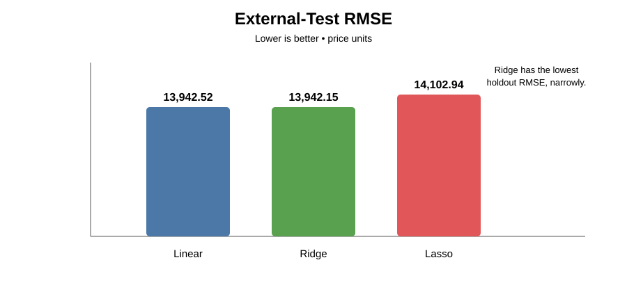
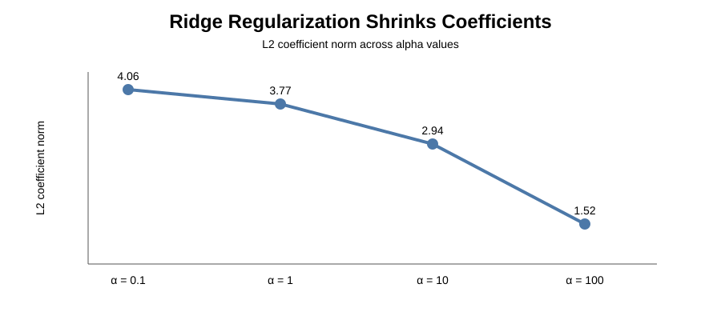
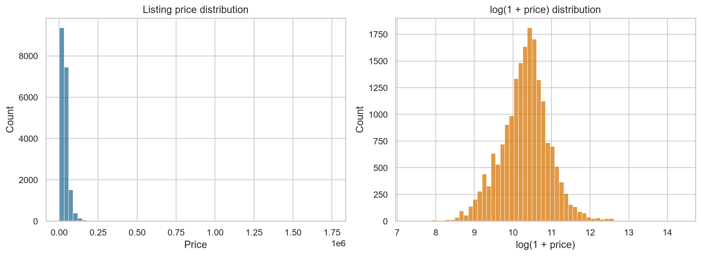
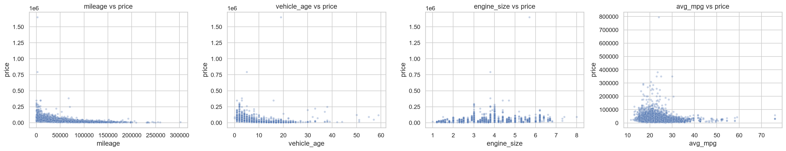
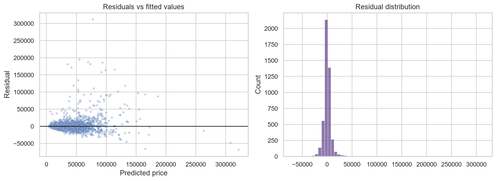

# 🚗 Used Car Price Prediction
### Linear Regression • Ridge • Lasso

**End-to-end machine-learning project for used-car valuation, model comparison, diagnostics, and dealership pricing intelligence.**

[Notebook](notebooks/01_complete_used_car_analysis.ipynb) •
[Questions](docs/questions.md) •
[Methodology](docs/methodology.md) •
[Results](outputs/reports/analysis_summary.md) •
[Tests](tests/test_data.py)

---

This project compares **Multiple Linear Regression, Ridge Regression, and Lasso Regression** using schema-aware cleaning, leakage-safe preprocessing, cross-validation, measured diagnostics, and business-focused pricing analysis.

## 🌟 Why this project stands out

- **16/16 assignment questions answered** with reproducible code and committed outputs.
- **Leakage-safe sklearn pipelines** for imputation, scaling, rare-category handling, and encoding.
- **Three regression approaches compared** on the same holdout and five-fold cross-validation strategy.
- **Real model diagnostics** including residual behavior, VIF-style multicollinearity checks, and Ridge coefficient shrinkage.
- **Business-ready outputs** for valuation, depreciation, inventory selection, and pricing review.
- **Automated GitHub Actions tests** protect the core analysis logic.

## 📊 Portfolio snapshot

| Item | Result |
| --- | --- |
| Dataset | Used Car Listings: Features and Price Prediction |
| Training data | 19,109 rows × 36 columns |
| External test data | 4,778 rows × 36 columns |
| Models | Linear Regression, Ridge, Lasso |
| Best external-test RMSE | **Ridge Regression — 13,942** |
| Best external-test R² | **Ridge Regression — 0.7322** |
| Lasso feature reduction | **273 coefficients set to zero** |
| Potentially underpriced listings | **565** |
| Potentially overpriced listings | **693** |
| Assignment coverage | **16 / 16 questions answered** |

## Correctness upgrades

- Q6 now compares both nominal categories and binary indicators such as damage/ownership/equipment flags against mean and median price.
- Q9 now measures numeric multicollinearity with VIF-style diagnostics and a condition number instead of only discussing it.
- Q10 now records Ridge coefficient shrinkage across every candidate alpha and tunes regularized models using RMSE in original price units.
- Q15 now evaluates age-related value retention across supported **brand, model, fuel type, and drivetrain** segments when sample size is sufficient.
- Deterministic pytest checks cover these corrected analytical behaviors, and GitHub Actions runs them automatically on every push and pull request.

> The corrected workflow has been rerun on the source datasets, and the committed outputs now include the regenerated VIF diagnostics, Ridge coefficient path, expanded categorical analysis, and multi-segment retention results.

## 💡 Key findings & business impact

- **Ridge Regression** produced the lowest external-test RMSE, narrowly outperforming the unregularized baseline.
- **Mileage** has one of the strongest negative relationships with price; vehicle age is also negatively associated with value.
- **Lasso** reduced the encoded feature set from 630 active coefficients to 357 by shrinking **273 coefficients to exactly zero**.
- The pricing screen flagged **565 potentially underpriced** and **693 potentially overpriced** listings using a ±20% rule.
- The outputs can support first-pass **vehicle valuation, trade-in negotiation, inventory acquisition, depreciation analysis, and listing-price review**.
- Pricing flags are screening signals only; inspection, local comparables, title/service history, geography, seller type, and market demand should still be considered.

## 🧠 Model results

| Model | Test MAE | Test RMSE | Test R² | Best alpha | Active features | Zero coefficients |
| --- | ---: | ---: | ---: | ---: | ---: | ---: |
| Linear Regression | 5,898 | 13,943 | 0.7322 | N/A | 630 | 0 |
| **Ridge Regression** | 5,904 | **13,942** | **0.7322** | 0.1 | 630 | 0 |
| Lasso Regression | 5,987 | 14,103 | 0.7260 | 0.0001 | 357 | 273 |

> Ridge has the lowest external-test RMSE. The difference from Linear Regression is small, so this is a narrow performance edge rather than a large practical gap.

## 📈 Model-quality visuals

### External-test RMSE comparison

Linear and Ridge are effectively tied on the external holdout; Ridge is lower by less than one dollar of RMSE, while Lasso trades a small amount of accuracy for a substantially sparser coefficient set.

### Ridge regularization path

As alpha increases, the Ridge coefficient norms shrink monotonically while all 630 encoded coefficients remain active, which is the expected L2-regularization behavior.

## 🔎 EDA highlights

### Price distribution and log transformation

### Numerical features vs price

### Linear Regression residual diagnostics

The generated tables provide deeper EDA coverage for categorical pricing, outliers, depreciation, segment value retention, correlations, model coefficients, and pricing opportunities.

## ✅ All 16 questions covered

The full assignment is documented in [docs/questions.md](docs/questions.md), and the executed notebook answers **Q1 through Q16**:

1. Dataset understanding and data structures
2. Data quality and cleaning
3. Feature classification and selection
4. Price distribution and outlier analysis
5. Numerical features vs price
6. Categorical features vs price
7. Encoding, scaling, and leakage prevention
8. Baseline Multiple Linear Regression
9. Linear Regression interpretation and diagnostics
10. Ridge Regression and alpha tuning
11. Lasso Regression and feature selection
12. Cross-validation of all three models
13. Comprehensive Linear vs Ridge vs Lasso comparison
14. Vehicle valuation business analysis
15. Depreciation and inventory strategy
16. Pricing strategy and opportunities

## 🔁 Reproducibility

### Cross-validation

The workflow now uses **5-fold shuffled, price-stratified cross-validation with `random_state=42`**. Training prices are quantile-binned only for fold construction so each validation fold receives a more comparable target distribution. A generated fold-balance table makes the stability check auditable.

The committed results were produced with the environment recorded in [outputs/reports/run_metadata.json](outputs/reports/run_metadata.json):

- **Python:** 3.14.7
- **pandas:** 3.0.5
- **NumPy:** 2.5.2
- **scikit-learn:** 1.9.0
- **Random state:** 42
- **Cross-validation folds:** 5 (default workflow)
- **Recorded platform:** Windows 11

### 🔁 Reproducibility checklist

- [x] Environment versions recorded
- [x] Random state recorded
- [x] Source train/test dimensions recorded
- [x] Raw source files are never overwritten
- [x] Leakage-safe preprocessing fitted only on training folds
- [x] External labeled test set kept separate from training
- [x] Generated tables, figures, diagnostics, and summaries committed
- [x] Deterministic correctness tests included and run in GitHub Actions
- [x] Command-line workflow included

## Verified source dimensions

- Raw train: **19,109 rows × 36 columns = 687,924 cells**
- Raw test: **4,778 rows × 36 columns = 172,008 cells**

Cleaning removes 34 train rows and 10 test rows with unusable target values. Predictor gaps are handled inside leakage-safe preprocessing pipelines.

## 🗂️ Project structure

    used-car-price-prediction-linear-ridge-lasso/
    ├── README.md
    ├── requirements.txt
    ├── .github/
    │   └── workflows/
    │       └── tests.yml
    ├── data/raw/README.md
    ├── docs/
    │   ├── questions.md
    │   └── methodology.md
    ├── notebooks/
    │   └── 01_complete_used_car_analysis.ipynb
    ├── scripts/
    │   ├── build_notebook.py
    │   └── run_analysis.py
    ├── src/
    │   ├── __init__.py
    │   ├── config.py
    │   ├── data.py
    │   ├── modeling.py
    │   ├── reporting.py
    │   └── workflow.py
    ├── tests/test_data.py
    └── outputs/
        ├── figures/
        ├── tables/
        └── reports/

## ▶️ Run the project

### 1. Clone

    git clone https://github.com/mightyalok00/used-car-price-prediction-linear-ridge-lasso.git
    cd used-car-price-prediction-linear-ridge-lasso

### 2. Create the environment

    python -m venv .venv
    .\.venv\Scripts\Activate.ps1
    python -m pip install --upgrade pip
    python -m pip install -r requirements.txt

### 3. Provide the source CSV files

Recorded source paths:

    D:\Used Car Listings Features and Price Prediction\train.csv
    D:\Used Car Listings Features and Price Prediction\test.csv

Or pass custom locations:

    python scripts\run_analysis.py --train "D:\path\to\train.csv" --test "D:\path\to\test.csv"

### 4. Run the full analysis

    python scripts\run_analysis.py

Or open the executed notebook:

    jupyter notebook notebooks\01_complete_used_car_analysis.ipynb

### 5. Run tests

    python -m pytest -q

### 6. Review the most useful outputs

- [Analysis summary](outputs/reports/analysis_summary.md)
- [Model comparison](outputs/tables/model_comparison.csv)
- [CV fold price balance](outputs/tables/cv_fold_price_balance.csv)
- [Depreciation by age band](outputs/tables/depreciation_by_age_band.csv)
- [Segment value retention](outputs/tables/segment_value_retention.csv)
- [Top potentially underpriced listings](outputs/tables/top_100_potentially_underpriced.csv)
- [Top potentially overpriced listings](outputs/tables/top_100_potentially_overpriced.csv)

## 🧪 Methodology

The models learn **log1p(price)** to reduce target skew. Predictions are converted back to price units before MAE, Median Absolute Error (MedianAE), MSE, RMSE, and R² are calculated.

The preprocessing pipeline:

- imputes missing numerical values
- handles missing categorical values
- scales continuous variables
- groups rare categorical levels
- one-hot encodes categorical features
- handles unseen test categories safely
- prevents test information from leaking into training

See [docs/methodology.md](docs/methodology.md) for the full methodology.

## ⚠️ Important interpretation notes

- The supplied test file contains price, so it is treated as a **labeled external holdout** rather than mixed into training.
- Coefficients describe model associations, not causal effects.
- The test set appears easier than the training CV folds, so external-test performance should be interpreted alongside CV results.
- Extreme prices remain in the analysis; log-target training reduces their influence but does not eliminate large-dollar residuals.
- **MedianAE is reported alongside RMSE** as a more robust error measure because RMSE is especially sensitive to a few ultra-expensive vehicles.
- Underpriced/overpriced labels require vehicle inspection and local-market validation before any business decision.

## 🚧 Limitations & Future Work

- A small number of ultra-expensive vehicles still create large squared errors, so fold RMSE can vary even after price-stratified cross-validation.
- The external test set appears easier than the CV folds, so both holdout and cross-validation results should be considered together.
- Important real-world pricing variables such as trim, geography, service/title history, seller type, reconditioning cost, negotiation, and local demand are not fully represented.
- Pricing flags are screening signals, not guaranteed buy/sell recommendations.
- The current models provide **point predictions only**. A strong future extension would add calibrated prediction intervals or conformal prediction so each valuation includes an uncertainty range.
- Further nonlinear or robust regression models could be explored later, provided they use the same leakage-safe evaluation design.

## 🏷️ Repository topics

`machine-learning` · `data-science` · `python` · `scikit-learn` · `linear-regression` · `ridge-regression` · `lasso-regression` · `price-prediction`

These topics make the project easier to discover for recruiters, learners, and developers searching for regression and ML portfolio work.

## 🎯 Repository purpose

This project is designed as a **Data Science / Machine Learning portfolio project** demonstrating regression modeling, model comparison, reproducible analysis, and business interpretation rather than only model training.

## ✅ Final verification

- **CV stability improved:** Ridge CV RMSE standard deviation decreased from ~12,325 to ~8,660 after price-stratified fold construction (~30% reduction).

- **Cross-validation:** 5-fold shuffled CV with `random_state=42`
- **Latest workflow status:** passing on GitHub Actions
- **Validation report:** PASS
- **Assignment coverage:** 16 / 16 questions
- **Notebook stored execution errors:** 0
- **License:** MIT
- **Best external-test model:** Ridge Regression
- **Best external-test RMSE:** approximately 13,942

## 📄 License

The source code and project documentation are released under the [MIT License](LICENSE).

The dataset itself is **not redistributed by this repository** and remains subject to the terms of its original provider. Users should obtain the source CSV files from the original dataset source and comply with its applicable terms.

---

**Built by Alok Agarwal** • Data Science / AI-ML portfolio project

⭐ If this project is useful, consider starring the repository.

